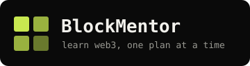

<p align="center">
  
</p>

# BlockMentor — AI Mentor Agent for Web3 (Agentmaxxing Week 1)

Week 1 (BlockMentor.v1): https://blockmentor-agentmaxxing.vercel.app/

## The problem it solves

Learning Web3 and Solidity as a beginner is fragmented: scattered tutorials, no idea where to start, no time budget, and no instant feedback. BlockMentor is a chat agent that answers with structure instead of links — a level-aware study plan, a beginner quiz, or a clear concept breakdown — instantly and for free, with no wallet, payment, or signup required to use its core tools.

## Description

BlockMentor is a Next.js chat app with a Gemini tool-calling loop and five tools. You type a prompt, the model picks a tool, and the UI shows each tool step and its structured result. Two of the tools are local, deterministic learning tools built for this week (`get_study_plan`, `generate_quiz`, `explain_solidity_concept`); two are starter tools kept from the kit (`get_my_wallet`, `roll_dice`). The starter's wallet/x402 payment code is preserved so paid tools can be switched on in Week 2 without re-architecting.

Built on the official [Agentmaxxing starter kit](https://www.npmjs.com/package/agentmaxxin) (`npx agentmaxxin blockmentor-agentmaxxing-web`).

## Tech stack (exact installed versions)

| Layer | Version |
| :--- | :--- |
| Next.js (App Router) | 16.4.0 |
| React / React DOM | 19.3.0 |
| TypeScript | 5.9.3 |
| Tailwind CSS / @tailwindcss/postcss | 4.3.3 |
| @google/genai (Gemini SDK) | 2.28.0 |
| viem (Stellar/Base wallet helpers) | 2.57.4 |
| lucide-react | 1.53.0 |
| @base-ui/react / shadcn / tw-animate-css | 1.8.0 / 1.0.0 / 1.4.0 |
| Node.js (runtime used here) | 22.23.2 |

## AI models

| Model | Status |
| :--- | :--- |
| `gemini-3.8-flash` | **Verified.** Configured in the Vercel production environment (`GEMINI_MODEL`); Google's API referenced it in a 429 quota response. This is what the live demo runs. |
| `gemini-flash-latest` | **Untested fallback.** The code default in `agent/agent.ts` when `GEMINI_MODEL` is unset. Not verified against the API — do not claim it as supported. |

Gemini free-tier quota observed during development: 20 requests/day for `gemini-3.8-flash`.

## All 5 tools

| # | Tool | Kind | What it does |
| :--- | :--- | :--- | :--- |
| 1 | `get_study_plan` | Local, deterministic | Structured study plan: `timeAllocation` (minutes sum exactly to the request), `learningObjectives`, `practiceActivity`, `finalReview`. Inputs: `topic`, `minutes` (clamped 15–240), `level`. |
| 2 | `generate_quiz` | Local, deterministic | Beginner quiz for a supported concept: 1–3 multiple-choice questions with options, `answerIndex`, and `explanation`. Unknown topic → returns the supported topic list. |
| 3 | `explain_solidity_concept` | Local, deterministic | Structured concept explanation: `summary`, `syntax`, `keyPoints`, `example`, `commonMistakes`. Unknown concept → returns the supported concept list. |
| 4 | `get_my_wallet` | Starter tool | Reads the agent's own demo wallet address and Base Sepolia balance (read-only). |
| 5 | `roll_dice` | Starter tool | Plain deterministic dice roll; no wallet, no API. |

Supported quiz/explanation topics: Solidity mappings, arrays, structs, data locations, `msg.sender`, error handling (`agent/concepts.ts`).

## Key features

- Chat UI (`app/page.tsx`) that auto-lists every registered tool from `GET /api/agent` — no manual tool wiring in the UI.
- Gemini function-calling loop with visible per-tool steps and structured JSON results.
- Local learning tools: no external API, no randomness, no payment — same input always returns the same output.
- Wallet-aware loop preserved from the starter (read-only by default; payment path intact for Week 2).
- Secrets stay local: `.env`, `.env.local`, `.agent-wallet.json` are gitignored; no keys in the repo.

## Demo video

To be added after recording.

## Install, configure, run

```bash
git clone https://github.com/sadiyamulani03/blockmentor-agentmaxxing.git
cd blockmentor-agentmaxxing-web
npm install
cp .env.example .env   # then paste your key: GEMINI_API_KEY=...
npm run dev            # open http://localhost:3000
```

- Get a free Gemini key at https://aistudio.google.com/apikey — never commit it or paste it into docs/screenshots.
- Optional: `GEMINI_MODEL` overrides the model (production uses `gemini-3.8-flash`); `WALLET_PRIVATE_KEY` supplies a test key, otherwise use the in-app Create wallet button.
- Build check: `npm run build` and `npx tsc --noEmit`.

## Testing the local tools

1. Send `Create a 30-minute beginner study plan for Solidity mappings.` → expand the `get_study_plan` step: four sections summing to 30 minutes, three objectives, practice activity, review checklist.
2. Send `Quiz me on Solidity mappings, 2 questions.` → `generate_quiz` returns 2 questions with answers and explanations.
3. Send `Explain msg.sender.` → `explain_solidity_concept` returns summary, syntax, key points, example, common mistakes.
4. Determinism: repeat any of the above — identical output every time.

## Project structure

| Path | Description |
| :--- | :--- |
| `agent/tools.ts` | All 5 tool definitions. |
| `agent/concepts.ts` | Local concept/quiz bank for tools 2–3 (content only, no I/O). |
| `agent/agent.ts` | Gemini tool-calling loop (unchanged from starter). |
| `agent/wallet.ts` | Starter wallet + x402 payment helpers (unchanged). |
| `app/page.tsx` | Chat UI, setup steps, auto tool list. |
| `app/api/agent/route.ts` | GET status/tools, POST runs the agent. |
| `app/api/wallet/route.ts` | Creates/reads the demo wallet. |
| `public/blockmentor-logo.svg` | Product logo (local SVG, no external assets). |
| `.env` | Local secrets — gitignored, never committed. |

## Week 1 learnings

1. Traced the chat flow from `app/page.tsx` → `app/api/agent/route.ts` → the Gemini function-calling loop, and saw how tool schemas (`name`, `description`, JSON parameters) drive model decisions.
2. Replaced the starter's paid-weather sample with `get_study_plan`, then added `generate_quiz` and `explain_solidity_concept` sharing one content bank — deterministic tools are free, testable, and quota-independent.
3. Fixed real build failures: a bad `shadcn` CSS import, a dependency downgraded by `npm audit fix --force`, and mixed Windows/WSL installs. Lesson: never run `npm audit fix --force`, install deps from one OS only.

## Future scope (planned, not built)

- **Week 2 — x402 payments:** wire a paid external-data tool through the starter's existing `verifyPayment`/`payAndFetch` helpers (requires a funded demo wallet; not enabled in Week 1).
- **Week 3 — ZK integration:** explore a ZK-backed credential/attestation feature for completed study plans.
- Expand the concept bank and quiz difficulty levels; add spaced-repetition review plans.

## Socials

- **X (Twitter):** dedicated BlockMentor product X page — *to be added* (page not created yet; no URL is claimed here).
- Starter kit credit: [RiseIn Agentmaxxing kit](https://www.npmjs.com/package/agentmaxxin).

## Week 1 acceptance checklist

- [x] Deployed live demo with exact line `Week 1 (BlockMentor.v1): https://blockmentor-agentmaxxing.vercel.app/`
- [x] Logo: local product logo `public/blockmentor-logo.svg` (no external assets)
- [x] README covers: name, problem, description, tech stack (exact versions), all 5 tools, AI models (verified vs untested), key features, demo video placeholder, future scope (Week 2/3, labeled planned), socials
- [x] Exactly 2 new local tools added on top of the starter's 3 → 5 total, all registered in the UI
- [x] New tools deterministic, no external API, no wallet/payment, no new dependencies
- [x] Wallet-payment and agent-loop starter code preserved; no wallet created or funded
- [x] No secrets in repo; `.env*` and `.agent-wallet.json` gitignored
- [x] Build passes (`npm run build`) and typecheck passes (`npx tsc --noEmit`)

## Troubleshooting

| Problem | Solution |
| :--- | :--- |
| Page says to add `GEMINI_API_KEY` | Add it to `.env`, restart `npm run dev`. |
| Agent never calls a study/quiz tool | Mention a topic (and minutes/level) in the prompt. |
| `429` quota errors from Gemini | Free tier is ~20 requests/day; wait for reset. |
| Port 3000 in use | `npm run dev -- -p 3001` |

## License

MIT (starter kit license).
